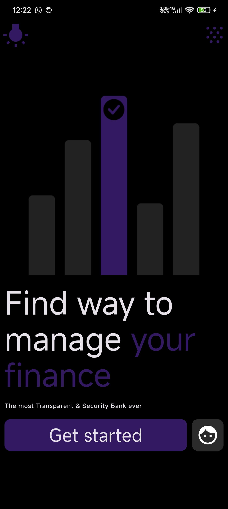
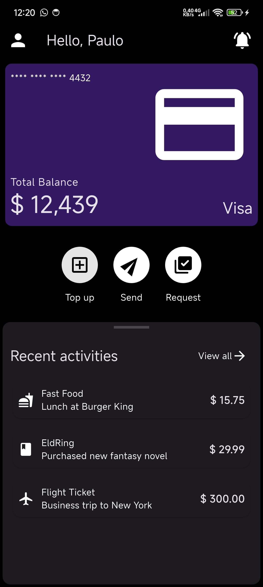
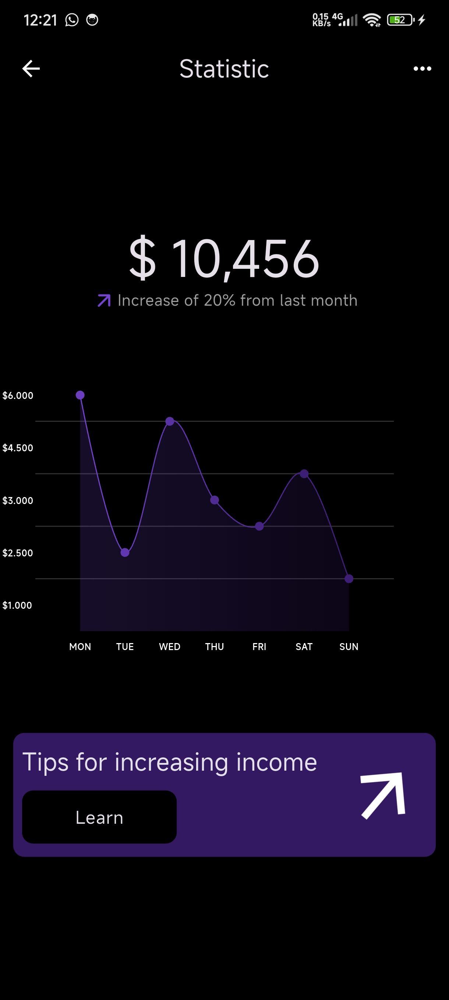
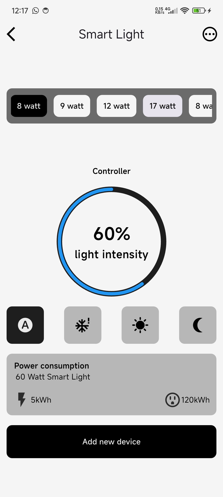
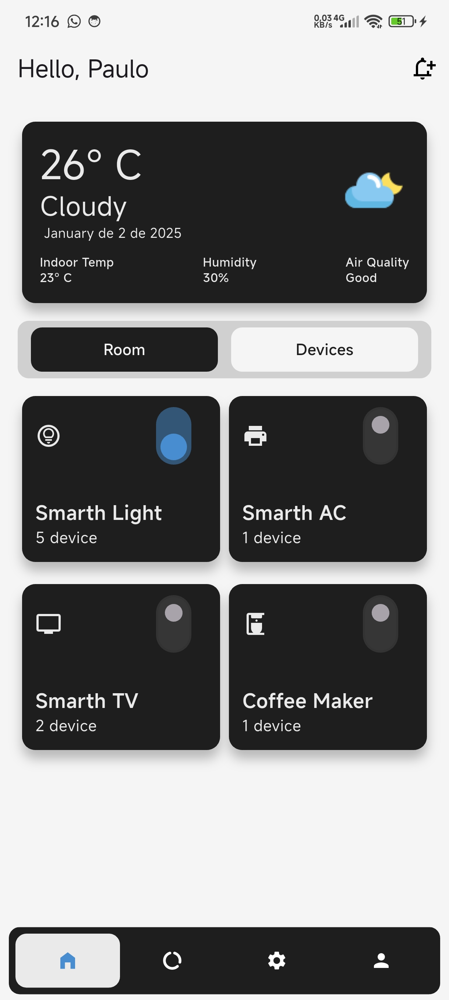
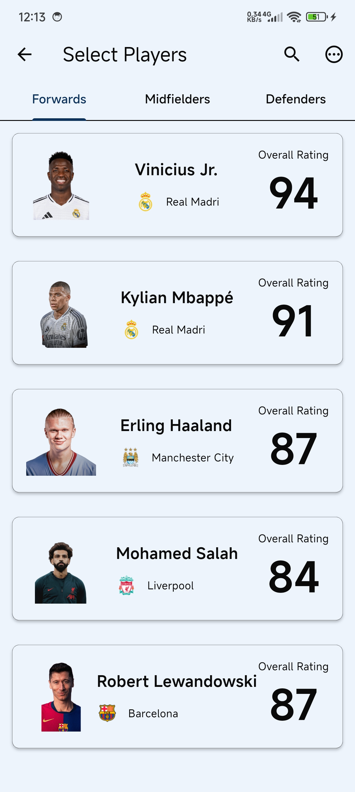
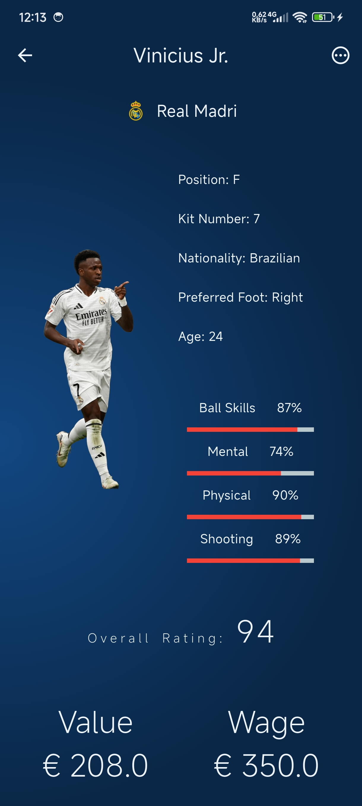

# Projeto de Prática em UI/UX com Flutter

Bem-vindo ao meu repositório de prática em UI/UX com Flutter! Este projeto é uma exploração prática dos princípios modernos de design UI/UX, implementados com Flutter. Aqui, busco desenvolver e aprimorar minhas habilidades criando interfaces de aplicativos visualmente atraentes e funcionais em diversos domínios.

## 🚀 Funcionalidades

- **Painel Financeiro**: Uma interface elegante e interativa para gerenciamento financeiro.
- **Painel de Dispositivos Inteligentes**: Ferramentas para gerenciar seus dispositivos inteligentes de sua residência.

## 📸 Capturas de Tela

Aqui estão algumas capturas de tela das interfaces que desenvolvi:

### Controle Financeiro

### Gerenciador de Dispositivos Inteligentes

### Painel de Estatísticas de Jogadores

## 🛠️ Tecnologias Utilizadas

- **Flutter**: Framework usado para construir aplicativos multiplataforma com um único código base.
- **Dart**: Linguagem de programação para escrever a lógica do aplicativo.
- **Figma**: Ferramentas para design de UI/UX.

## 🌟 Objetivo

Este repositório é destinado ao aprendizado, experimentação e demonstração de design UI/UX usando Flutter. Está aberto a feedbacks e colaborações para novas interfaces!

## 🤝 Contribuição

Sinta-se à vontade para fazer um fork deste repositório e sugerir melhorias ou adcionar sua interface. Contribuições são sempre bem-vindas!

## 📄 Licença

Este projeto está licenciado sob a Licença MIT - veja o arquivo [LICENSE](LICENSE) para mais detalhes.

## 💬 Contato

Se tiver alguma dúvida ou sugestão, entre em contato:

- **GitHub**: [@pauloRodri29](https://github.com/pauloRodri29)
- **Email**: [rodriguesjp29@gmail.com](mailto:rodriguesjp29@gmail.com)

Obrigado por conferir meu projeto! 🚀
