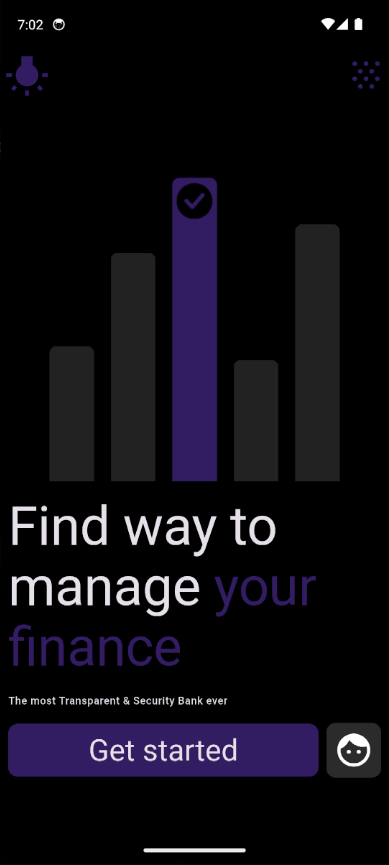
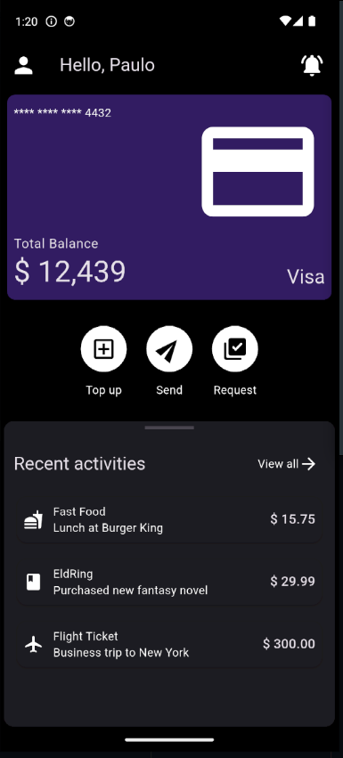
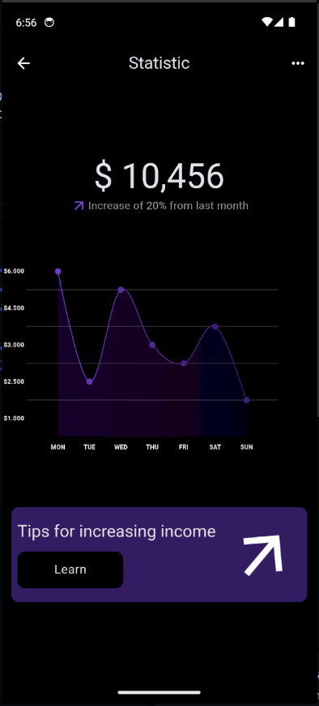

# Projeto de Prática em UI/UX com Flutter

Bem-vindo ao meu repositório de prática em UI/UX com Flutter! Este projeto é uma exploração prática dos princípios modernos de design UI/UX, implementados com Flutter. Aqui, busco desenvolver e aprimorar minhas habilidades criando interfaces de aplicativos visualmente atraentes e funcionais em diversos domínios.

## 🚀 Funcionalidades

- **Painel Financeiro**: Uma interface elegante e interativa para gerenciamento financeiro.
- **Gestão de Alunos**: Ferramentas para acompanhar dados e progresso acadêmico dos alunos.
- **Gerenciador de Armazenamento**: Organize e acesse itens armazenados de forma eficiente.
- **E Mais!**: Telas adicionais que apresentam desafios e soluções diversificadas de UI/UX.

## 📸 Capturas de Tela

Aqui estão algumas capturas de tela das interfaces que desenvolvi:

### Painel Financeiro

## 🛠️ Tecnologias Utilizadas

- **Flutter**: Framework usado para construir aplicativos multiplataforma com um único código base.
- **Dart**: Linguagem de programação para escrever a lógica do aplicativo.
- **Figma/Adobe XD**: Ferramentas para design de UI/UX (se aplicável).

## 🌟 Objetivo

Este repositório é destinado ao aprendizado, experimentação e demonstração do meu progresso no design UI/UX usando Flutter. Estou aberto a feedbacks e colaborações para melhorar ainda mais essas interfaces!

## 🤝 Contribuição

Sinta-se à vontade para fazer um fork deste repositório e sugerir melhorias. Contribuições são sempre bem-vindas!

## 📄 Licença

Este projeto está licenciado sob a Licença MIT - veja o arquivo [LICENSE](LICENSE) para mais detalhes.

## 💬 Contato

Se tiver alguma dúvida ou sugestão, entre em contato:

- **GitHub**: [@pauloRodri29](https://github.com/pauloRodri29)
- **Email**: [rodriguesjp29@gmail.com](mailto:rodriguesjp29@gmail.com)

Obrigado por conferir meu projeto! 🚀
